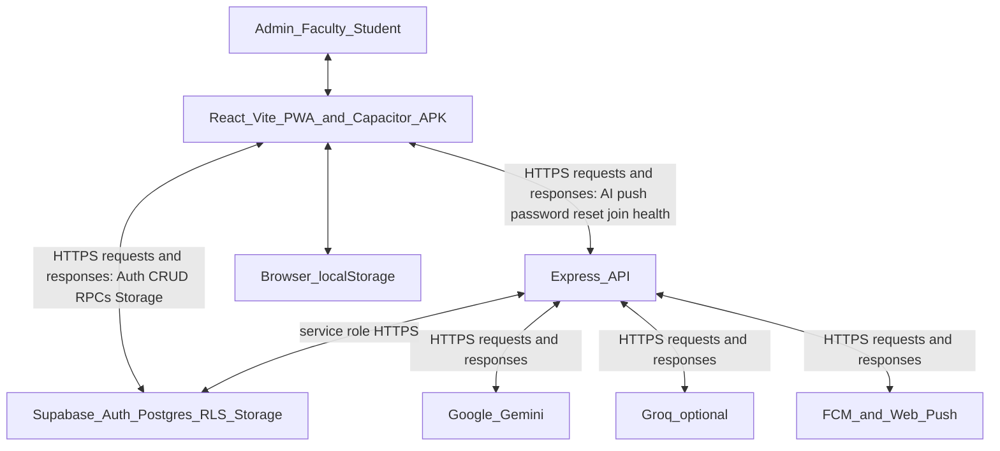
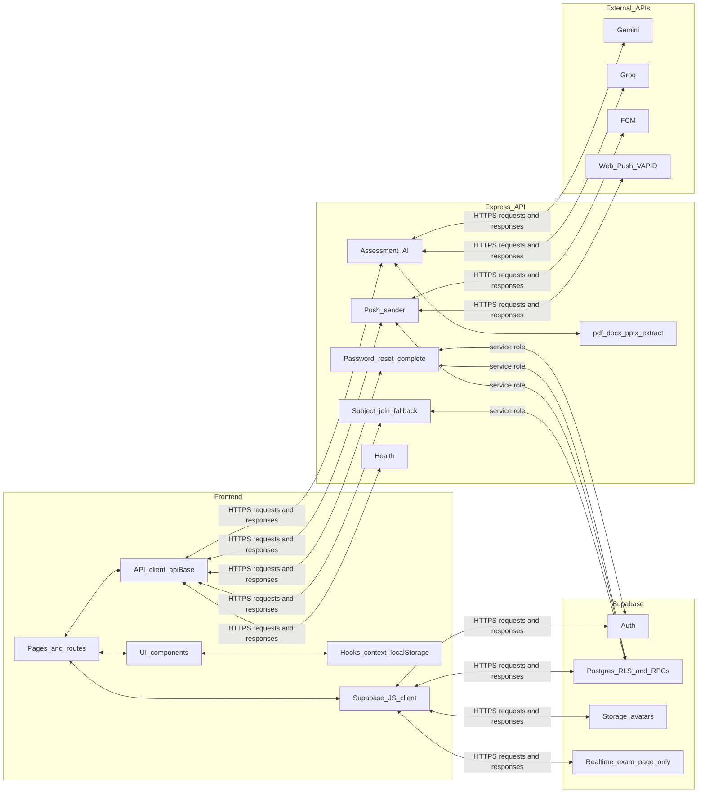

# ExamNexus system architecture

Accurate map of how the running app moves data. Most reads and writes go **browser or APK ↔ Supabase** (anon key, user JWT, row-level security). A smaller set of calls goes **browser or APK ↔ Express** over HTTPS. Express then calls Gemini, optional Groq, Firebase Cloud Messaging, and Web Push, and uses the Supabase **service role** only for privileged work.

The same Express app runs locally (`backend/server.js`, port 5000) and on Vercel (`api/index.js` rewrites `/api/*` into `backend/createApp.js`).

This replaces the older two diagrams (layered “backend is Supabase” picture, and the three-column development picture). Section 6 lists what those images leave out. Section 7 is a prompt to redraw them.

---

## 1. System diagram



Clients are the Vite web app, the installed PWA (`public/sw.js`), and the Capacitor Android app (`com.examnexus.app`). iOS is the same web UI in a Capacitor shell.

---

## 2. Development diagram

Three columns, matching the development diagram’s layout, plus the external APIs the Express column actually calls. Arrows are two-way because every call returns a body.



Subjects, exams, questions, results, announcements, and grading are **not** Express services. The UI calls them through `frontend/supabaseClient.js` and `frontend/utils/supabaseData.js` (and `adminData.js`). Row-level security is a Postgres feature, not a backend service. Live screens poll about every 5 seconds (`frontend/hooks/useRealtimeFetch.js`). Supabase Realtime is used on the live exam page only (`TakeAssessmentPage.jsx`).

---

## 3. Two HTTPS paths

`frontend/utils/apiBase.js` picks the Express base:

| Where the UI runs | Express base |
|---|---|
| Dev web | `http://localhost:5000` |
| Production web (Vercel) | same-origin `/api` |
| Capacitor APK | `VITE_API_BASE_URL` (deployed `/api`; emulator localhost becomes `10.0.2.2`) |

Supabase is always the project URL in `VITE_SUPABASE_URL`, from `frontend/supabaseClient.js`. The browser never receives the service-role key.

### 3.1 Frontend ↔ Supabase (main path)

Anon key plus the signed-in user’s JWT. RLS policies in `database/*.sql` decide which rows that JWT can see.

| Area | Examples |
|---|---|
| Auth | `signInWithPassword`, `signUp`, `getSession`. Session stored as `examnexus-auth-token`. |
| Profile | `public.users` via RPCs such as `ensure_user_profile`, `get_my_account_access`, `update_user_avatar`. Cached in `examnexus_user`. |
| Teaching data | `subjects`, `subject_students`, `subject_section_invites`, `exams`, `questions`, `question_bank`, `exam_results`, `student_answers` |
| Exam ops | `exam_integrity_events`, `exam_retake_requests`, `exam_student_exclusions` |
| Comms | `announcements` and comment/reaction tables, `admin_announcements`, notification RPCs |
| Devices | `push_devices` via `upsert_push_device` / `remove_push_device` (send still goes through Express) |
| Storage | Bucket `avatars`. Upload from `frontend/pages/shared/ProfilePage.jsx`, then `update_user_avatar`. |
| Catalog | `school_catalog`, `password_reset_requests` (user side is RPCs; admin completion is Express) |

Legacy Express exam routes in `createApp.js` (`GET /exams`, `POST /manual-exam`, `GET/PUT/DELETE /exam/:examId`) and `GET /analytics/:examId` are **not** called by the UI. The UI uses Supabase for those.

### 3.2 Frontend ↔ Express (privileged path)

Mounted in `backend/createApp.js`: `/subjects`, `/analytics`, `/password-reset`, `/assessment-ai`, `/push`. Calls below are the ones the UI actually makes.

| Client module | Method and path | What comes back |
|---|---|---|
| `frontend/hooks/useConnectionStatus.js` | `GET /health` | Config probe (Supabase, AI, push, service role present or not) |
| `frontend/utils/assessmentAi.js` | `GET /assessment-ai/public-config` | Which AI provider is configured (no secrets) |
| same | `POST /assessment-ai/generate-from-prompt` | Questions from a topic. Gemini prompt key, or Groq if `AI_PROMPT_PROVIDER=groq` |
| same | `POST /assessment-ai/classify-document` | Upload classified as questionnaire or study material |
| same | `POST /assessment-ai/extract-document` | Plain text from pdf, docx, or pptx |
| same | `POST /assessment-ai/document-plan` | Chunk plan for a long source (no model call) |
| same | `POST /assessment-ai/analyze-document-text` | Questions from extracted text (Gemini document key) |
| same | `POST /assessment-ai/generate-from-source-text` | One small round, at most 5 questions |
| `frontend/utils/pushNotifications.js` | `GET /push/vapid-public-key` | Public VAPID key so the browser can subscribe |
| `frontend/utils/pushDispatch.js` | `POST /push/announce` | Faculty announcement pushed to enrolled students |
| same | `POST /push/broadcast` | Admin broadcast |
| same | `POST /push/notify-users` | Push to an explicit user list |
| `frontend/utils/passwordReset.js` | `POST /password-reset/complete` | Admin sets the new auth password (service role). Other reset steps are Supabase RPCs |
| `frontend/pages/Student/StudentSubjectsPage.jsx` | `POST /subjects/join` | Enrollment fallback when `enroll_student_by_invite_code` is missing |

Faculty AI routes send the user’s Bearer token. `requireFaculty` checks an approved faculty (or admin) row with the service role.

Document text never leaves the server for a third-party OCR product. Extraction is local: `pdf-parse`, Mammoth (`.docx`), JSZip (`.pptx`) in `backend/lib/`. The extracted text is what Gemini receives.

`backend/routes/generate.js` (OpenAI) and `backend/routes/extract.js` are **not mounted**.

---

## 4. External API keys

Names only. Values stay in `backend/.env` or the Vercel project. The frontend bundle only gets `VITE_*` values.

### Google Gemini (assessment AI)

Used by `backend/lib/aiProvider.js`.

| Name | Role |
|---|---|
| `GEMINI_DOCUMENT_API_KEY`, else `GEMINI_API_KEY`, `GOOGLE_API_KEY`, or `GOOGLE_GEMINI_API_KEY` | Document and extracted-text generation |
| `GEMINI_PROMPT_API_KEY` | Prompt / topic generation (separate key) |
| `GEMINI_MODEL`, `GEMINI_DOCUMENT_MODEL`, `GEMINI_ASSESSMENT_MODEL` | Document model id |
| `GEMINI_PROMPT_MODEL` | Prompt model id |

### Groq (optional prompt path)

| Name | Role |
|---|---|
| `GROQ_API_KEY` | Key for the OpenAI-compatible Groq API |
| `AI_PROMPT_PROVIDER` | Set to `groq` to send prompt generation to Groq instead of Gemini |
| `GROQ_MODEL`, `GROQ_ASSESSMENT_MODEL`, `GROQ_FALLBACK_MODEL` | Model ids |

### Supabase

| Name | Where | Role |
|---|---|---|
| `VITE_SUPABASE_URL`, `VITE_SUPABASE_ANON_KEY` | Frontend | Browser client. Safe to ship. RLS applies. |
| `SUPABASE_URL`, `SUPABASE_ANON_KEY` | Backend | Server reads with the anon key |
| `SUPABASE_SERVICE_ROLE_KEY` or `SUPABASE_SECRET_KEY` | Backend and Vercel only | Bypasses RLS. Password-reset completion, push recipient lookup, faculty check, enrollment fallback |

### Firebase Cloud Messaging and Web Push

| Name | Role |
|---|---|
| `FCM_SERVICE_ACCOUNT_JSON` or `FIREBASE_SERVICE_ACCOUNT_JSON` | FCM HTTP v1 (native APK tokens) |
| `FCM_PROJECT_ID` | Firebase project |
| `FCM_SERVER_KEY` or `FIREBASE_SERVER_KEY` | Legacy FCM server key, if v1 is not set |
| `VAPID_PUBLIC_KEY`, `VAPID_PRIVATE_KEY`, `VAPID_SUBJECT` | Browser Web Push. Only the public key is sent to the client |

### Other

| Name | Role |
|---|---|
| `VITE_API_BASE_URL` | Express base for the APK and for local overrides |
| `VITE_WEBSITE_URL` / `WEBSITE_URL` | Public site URL (exam links opened from the APK) |
| `OPENAI_API_KEY` | Only the unmounted `generate.js` route. Not used by the UI |

---

## 5. Hosting and on-device storage

- **Web:** Vite build (`dist/`) on Vercel. `vercel.json` sends `/api/(.*)` to `api/index.js` (serverless, 60s). Static files and the API share one origin, so production `API_BASE` is `/api`.
- **Local:** `npm start` in `backend/` on port 5000. The UI dev server is Vite (usually port 5173).
- **APK:** `capacitor.config.json`, `webDir: dist`. Plugins in use: App, Status Bar, Keyboard, Push Notifications, Browser, Filesystem, Share, Screen Orientation. Exam links from the app open the public website.
- **PWA:** `public/sw.js` (production). Web Push is delivered to the service worker, which posts `en:push-navigate` / `en:push-received` into the page.

Browser `localStorage` (not a server):

| Key | Holds |
|---|---|
| `examnexus-auth-token` | Supabase JWT session |
| `examnexus_user` | Cached profile (role, school, avatar) |
| `examnexus_theme` | Light or dark |
| `examnexus_saved_accounts`, `examnexus_account_pins`, `examnexus_remembered_passwords` | Device account switcher |
| `examnexus_sidebar_collapsed`, `examnexus_student_tab_flex` | Chrome layout |
| `examnexus_integrity_strikes_{examId}`, `examnexus_active_session_{examId}`, `examnexus_tab_lock_{examId}` | In-progress exam integrity |
| `examnexus_push_pending_removals` | Push token cleanup queue |

Exam integrity is in-app logic (Fullscreen API, visibility, blur, clipboard, multi-tab lock). It is not a third-party proctoring service.

---

## 6. What the attached diagrams leave out

### System architecture image

Users (Admin, Faculty, Student) flow one way into a React box, then into a single box labeled “BACKEND (SUPABASE)”, then PostgreSQL and a storage bucket marked future, with a side loop to three localStorage keys.

| Drawn | Actual |
|---|---|
| Supabase is the whole backend | Express in `backend/createApp.js` is a second backend. Supabase is the database, auth, and file bucket. |
| Arrows point only downward | Every hop returns data. Auth, CRUD, AI, and push are request and response. |
| Storage bucket and RLS marked “(Future)” | Avatars upload today (`ProfilePage.jsx`, bucket `avatars`). RLS is enabled in `database/*.sql` on users, subjects, exams, questions, results, answers, announcements, question bank, push devices, and related tables. |
| Web React only | Also the PWA (`public/sw.js`) and the Capacitor APK (`com.examnexus.app`). |
| No Gemini, Groq, FCM, or Web Push | Express calls all four. Document extract (`pdf-parse`, Mammoth, JSZip) runs on the server before Gemini sees the text. |
| localStorage is `examnexus_user`, theme, and “cached preferences” | Session key is `examnexus-auth-token`. Also saved accounts, sidebar, exam integrity, and push cleanup (section 5). |
| Tables stop at Users, Profiles, Subjects, Assessments, Questions, Enrollments, Results | Also question bank, announcements, integrity events, retakes, exclusions, push devices, school catalog, password-reset requests, and admin announcements. Account approval (`account_status`) gates login. |

### Development diagram

Three columns (Frontend, Backend, Database) with one-way arrows labeled “HTTPS (API requests / responses)” and “HTTPS (database & storage access)”.

| Drawn | Actual |
|---|---|
| Every feature is Frontend → Auth/Subject/Exam/Result service → Database | Those features are frontend + Supabase RPCs. Express does not own them. |
| “Security: RLS, policies, role-based access” sits in the backend column | RLS is inside Postgres. Express uses the service role only for the privileged routes in section 3.2. |
| Database column includes a general “Realtime update” service | Live UI is polling (`useRealtimeFetch.js`). One Realtime channel exists, on the exam-taking page. |
| One HTTPS arrow, left to right, into “the backend” | Two HTTPS arrows: frontend ↔ Supabase, and frontend ↔ Express. Express then has its own HTTPS arrows to Gemini, Groq, FCM, and Web Push. |
| Arrows point only to the right | Responses travel back. Both directions should be drawn. |

---

## 7. Prompt for a replacement image

Paste this into an image generator. It redraws both attached figures in one picture, with the missing boxes and two-way HTTPS labels.

```
Draw a clean technical architecture diagram for the ExamNexus exam platform, white background, thin black boxes, simple flat icons, two stacked figures.

FIGURE 1 — System architecture (top), same layered style as a boxed flowchart.

Layers from top to bottom:
1. USERS: Admin, Faculty, Student. Bidirectional arrows down to the client.
2. CLIENT: React (Vite), JavaScript, Tailwind CSS, React Router, Theme context, Lucide icons, plus two extra client boxes: PWA service worker and Capacitor Android APK. Bidirectional arrow to browser localStorage.
3. Split the old single "backend" layer into TWO boxes side by side, both bidirectional with the client:
   - SUPABASE (direct): Auth (email/password, approved roles Admin/Faculty/Student), Postgres tables (users, subjects, enrollments, exams, questions, question bank, results, answers, announcements, integrity events, retakes, push devices), Storage bucket "avatars" labeled CURRENT not future, Row Level Security labeled CURRENT not future.
   - EXPRESS API: assessment AI, document extract (pdf, docx, pptx), push send, admin password-reset completion, subject-join fallback, health.
4. EXTERNAL APIS under Express only, each with a bidirectional arrow: Google Gemini (document key and prompt key), Groq (optional), Firebase Cloud Messaging, Web Push VAPID.
5. Express also has a bidirectional arrow to Supabase labeled "service role".
6. LOCAL STORAGE box: examnexus-auth-token (session), examnexus_user, theme, saved accounts, exam integrity keys.

Every arrow between Client and Supabase, Client and Express, and Express and each external API is a TWO-WAY arrow labeled "HTTPS (API requests / responses)". Do not use one-way arrows. Do not mark storage or RLS as future.

FIGURE 2 — Development diagram (bottom), three 3D columns plus a fourth slim column.

Columns left to right:
- FRONTEND: Pages/Routes, UI components, state (hooks, context, localStorage), Supabase JS client, Express API client.
- EXPRESS API (not generic exam services): Assessment AI, Push sender, Password-reset completion, Subject-join fallback, Health, local pdf/docx/pptx extract. A note under the column: exams, subjects, and results are NOT in this column.
- SUPABASE: Auth, PostgreSQL with RLS and RPCs, Storage avatars (current), Realtime only on the live exam page. A note: most live screens use 5-second polling, not realtime.
- EXTERNAL: Gemini, Groq, FCM, Web Push.

Between FRONTEND and SUPABASE: a two-way arrow labeled "HTTPS (API requests / responses)".
Between FRONTEND and EXPRESS: a two-way arrow labeled "HTTPS (API requests / responses)".
Between EXPRESS and each external box: a two-way arrow labeled "HTTPS (API requests / responses)".
Between EXPRESS and SUPABASE: a two-way arrow labeled "service role".

No one-way arrows. No "RLS is future". No implication that every screen goes through Express.
```
